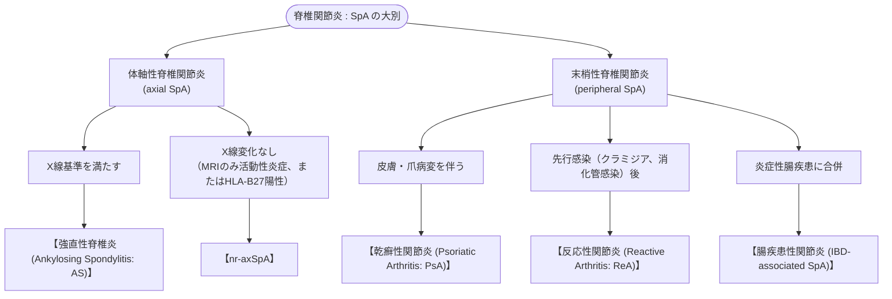

# 脊椎関節炎 (SpA)
親カテゴリ: [[clinical-flows/I_自己免疫・炎症性疾患/index|I章 自己免疫・炎症性疾患]]

## 疾患分類と病態概念

体軸（脊椎・仙腸関節）または末梢（付着部・腱鞘・非対称性関節）に炎症を来す血清反応陰性関節炎群[cite: 798]：

```mermaid
flowchart TD
    Start([脊椎関節炎 : SpA の大別]) --> AxSpA["体軸性脊椎関節炎<br>(axial SpA)"]
    Start --> PSpA["末梢性脊椎関節炎<br>(peripheral SpA)"]

    %% 体軸性脊椎関節炎 (axial SpA)
    AxSpA --> Ax_Xray["X線基準を満たす"]
    Ax_Xray --> AS["【強直性脊椎炎 (Ankylosing Spondylitis: AS)】"]

    AxSpA --> Ax_NoXray["X線変化なし<br>（MRIのみ活動性炎症、またはHLA-B27陽性）"]
    Ax_NoXray --> NrAxSpA["【nr-axSpA】"]

    %% 末梢性脊椎関節炎 (peripheral SpA)
    PSpA --> SkinNail["皮膚・爪病変を伴う"]
    SkinNail --> PsA["【乾癬性関節炎 (Psoriatic Arthritis: PsA)】"]

    PSpA --> PreInfect["先行感染（クラミジア、消化管感染）後"]
    PreInfect --> ReA["【反応性関節炎 (Reactive Arthritis: ReA)】"]

    PSpA --> IBD["炎症性腸疾患に合併"]
    IBD --> IBD_SpA["【腸疾患性関節炎 (IBD-associated SpA)】"]
```
